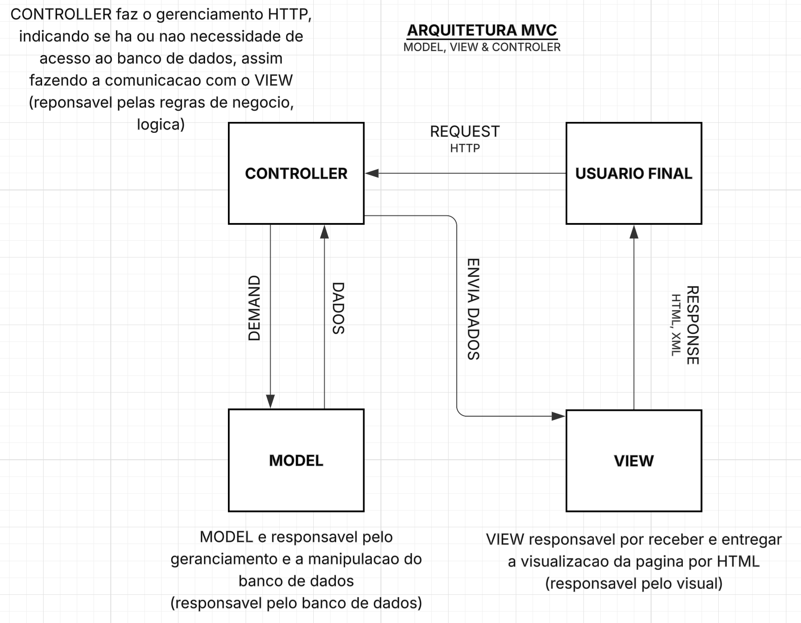

Laravel documentation - MVC

PORTALNPVEICULOS
├── .env --- Sistema de configuracoes sensiveis (senhas, logins, ips do banco de dados)
├── artisan --- Interface de linha de comandos
├── composer.json --- Gerenciador de Dependencias do projeto Laravel
├── package.json --- Definir dependencias de pacotes JS
│   ==== PASTAS ===
├── public --- Documento root do projeto (ponto de partida)
│    └── index.php --- Arquivo inicial da aplicacao (fotos, fonts, css, js)
├── bootstrap --- Arquivos de inicializacao do framework
├── config --- Arquivos de configuracao do Framework
│     └── database --- configuracao padrao para banco de dados, caso nao seja criado o parametro no arquivo .env
├── vendor --- Armazenamento de tudo que for gerado pelo Composer
├── routes --- Arquivos de rota que sera indicada pela / apos inserir o link de requisicao, fazendo o retorno das Views
│     └── web.php --- Rotas da aplicacao
│     └── api.php --- Criacao do webservice
├── database --- arquivos de definicao do banco de dados
├── resources --- Arquivos Visuais da aplicacao (Views)
│     └── css
│     │   └── app.css --- Aquivo CSS main, onde contem o conteudo principal da estilizacao das paginas
│     └── js
│     │   └── pages --- Arquivos .vue de cada pagina criada dentro do site
│     └── views
│         └── app.blade.php --- View que faz o carregamento da pasta resources/js para contrucao das paginas por vue.js, 
│                               seria como um arquivo "main" para a configuracao padrao das paginas.
├── storage --- Pasta que armazena conteudos que sao processados durante a aplicacao, logs, caches etc...
├── tests --- Arquivos de testes automatizados
└── app --- Onde fica toda a parte logica do codigo 
    └── HTTP
        └── controllers --- Nesta pasta existe uma regra da Convensao de MVC onde todos os nomes das pastas criadas devem ser no Singular "EstoqueController"

=== Comandos ===

Start
composer run dev

Listar as rotas
php artisan 

